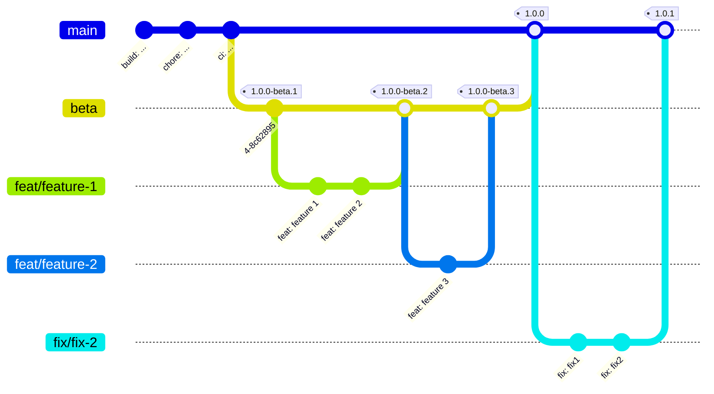

# Deployment Strategy

A good deployment strategy is crucial for the success of a project.
One of the main goals we want to achieve is the adoption of the continuous release strategy.
We decided to adopt a continuous release strategy: this implied having a robust test suite,
an adequate DVCS workflow and tools to automate the releases.

## Adopted DVCS workflow

The DVCS workflow we adopted is quite similar to `git-flow` but with substantial changes:
we use the `feature` branch as intended, with each feature well-isolated and defined.
Moreover, we used a `beta` branch to publish a non-stable version of the software; this can be
quite handy as it generates pre-releases that can be beta-tested before releasing a stable version.
Lastly, the `main` branch is intended to be the only stable branch: a push on this branch triggers
a new stable release.

We also added branch protection to the `main` and `beta` branches to prevent mistakes like pushing
on the wrong branch and inadvertently triggering a release.
These rules, however, also prevented tools like `semantic-release` from pushing on those branches.
To overcome this issue we created a team application `atedeg-bot` that has the push permission on
those branches so that the release process could succeed without failures.

We also added features and fixes by using GitHub's pull requests, allowing for code review and
comments from other team members before the code could be merged.
This way each team member can still have an overview of the other's work and point out possible
problems or ideas to improve it.

In addition, this type of workflow makes the classic `develop` branch unnecessary:
having a robust test suite joint with the use of semantic-release, allows one to merge directly to
`main` (or `beta`); only relevant changes trigger a new release without having to worry about when
to make a new one (as opposed to what happens when one has to deal with the `develop` branch).

An example of the workflow adopted by the team is shown in the image below:

## Tools to automate the release

### Conventional Commits

We decide to adopt [conventional commits](https://www.conventionalcommits.org/en/v1.0.0/) as the
convention for commit messages.
It's a lightweight convention on top of commit messages which provides a simple set of rules for
creating a more structured commit history, easier to handle by automated tools.

Since this standard forces a particular format for commit messages, it can be quite easy to get it
wrong and not comply with that format.
Therefore, we wanted an automated check that could reject any message not compliant with the
standard.

Even though there are tools such as
[`husky` and `commitlint`](https://github.com/conventional-changelog/commitlint),
these are not native to sbt and require manual intervention to be activated.
However, one could forget to activate these tools rendering them useless; our goal was that
as soon as a new user clones the repository and imports the project, they already have the commit
check automatically enabled.
To achieve this we developed an sbt plugin that automatically creates a git hook
to check all commit messages and rejects them in case they do not comply with the
conventional commits standard.
For more information see the
[plugin documentation](https://github.com/nicolasfara/sbt-conventional-commits).

> Initially, a
> [gradle plugin](https://github.com/nicolasfara/conventional-commits) was developed to check
> commit messages.
> However, having the need to work with sbt it was decided to rewrite the plugin native to sbt 
> reflecting all the gradle plugin's functionalities.

### Semantic release

Assigning versions to code can be a controversial activity.
People often assign versions based on intuition, wrong assumptions or, even worse, randomly.
In this regard, the [SemVer](https://semver.org/) standard is fundamental to have some shared
guidelines on how to properly assign a version based on some rules.
However, even following the SemVer guidelines there is still the problem of figuring out which
version to assign: identifying the extent of the changes made between versions to determine the new
version is not an easy task.
Doing so requires re-reading the commit history and getting an idea of what was changed; it is a
tedious task that typically no one wants to do.
In addition, this kind of task can be greatly complicated by the fact that many commit messages may
be ambiguous or may not precisely reflect the actual changes.

By adopting a convention for commit messages, such as `conventional-commit`, then it is much easier
to determine the extent of changes by simply analyzing the commit messages.
Moreover, automated tools can automatically perform this task and determine the version to be
assigned.

Tools like [`semantic-release`](https://semantic-release.gitbook.io/semantic-release/) automate
version assignment and automatically manage the release of artifacts.
Strictly following the SemVer specification, there is no longer room for human intervention in
assigning version numbers that are determined automatically and can reliably and consistently
communicate the impact of changes to consumers.
This tool, in addition to automatically determining the version to be assigned, can generate
(and update) the `CHANGELOG` file reporting in an organized manner all the changes made in the
various versions; it also interacts nicely with GitHub issues and PRs by creating comments concerning the
releases made.

Automating the entire process of versioning and artifact releasing gives the ability to focus
solely on project development without worrying about these easy-to-automate tasks, while also 
minimizing the possibility of errors.

### The final release workflow

Our workflow concerning semantic release is organized in the following steps:

1. The [`commit-analyzer`](https://github.com/semantic-release/commit-analyzer) plugin analyzes the
   commit messages from the last tag to the latest commit in order to determine the version bump to
   apply
2. The [`release-notes-generator`](https://github.com/semantic-release/release-notes-generator) 
   plugin generates the changelog with the changes since the last tag
3. The [`changelog`](https://github.com/semantic-release/changelog) plugin updates the
   `CHANGELOG.md` file in the repo with the changelog generated at the step above
4. With the [`exec`](https://github.com/semantic-release/exec) plugin we specify the commands needed
   to publish all the artefacts and the
   documentation site
   - The first command releases all the `jar`s to
     [_Maven Central_](https://search.maven.org/search?q=dev.atedeg.mdm)
   - The second command generates the documentation site
   - The third command publishes the `Dockerfile` of each subproject to
     [Docker Hub](https://hub.docker.com/)
5. The [`git`](https://github.com/semantic-release/git) plugin pushes the updated `CHANGELOG.md`
   into the repo
6. The [`github`](https://github.com/semantic-release/github) plugin generates the release and
   comments the issues closed since the last tag

For the full workflow specification take a look at the file
[`.releaserc.yml`](https://github.com/atedeg/mdm/blob/main/.releaserc.yml).

