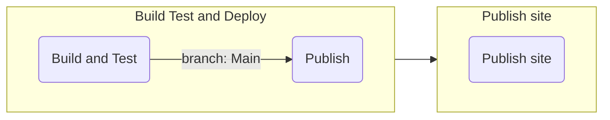

# Continuous Integration and Delivery

In this section we analyze the setup of the CI/CD, in particular the workflows used in the pipeline implementation.

The pipeline is structured as follows: the first stage is the `build` stage, which is responsible for building the project and running the tests.
The second stage is the `deploy` stage, which is responsible for deploying the artifacts like jars and docker images.
The `deploy` job is executed only if the `build` job is successful.
The `build` job further consists of multiple steps: the quality assurance in which `wartremover`, `scalafix` and `scalafmt` are executed; the test of
the project; the coverage report generation and the build of the documentation site.
The `deploy` job is executed only if the `build` job is successful and the workflow runs on the `main` branch and is not a pull request.
This job is intended to release the jars to Maven Central and build, for each project, a docker image to push to the Docker Hub; to achieve this,
a _GitHub Action_ was made. This GitHub Action configures a Java/Scala environment,
setup `semantic-release` if enabled, and then runs the commands to make a release. For further information about the `scala-release` action, please
visit the [action page's repository](https://github.com/atedeg/scala-release).

The documentation site is published in another workflow, which is triggered when the `Build Test and deploy` workflow is completed.
This workflow is responsible for building the documentation site and publishing it to the `gh-pages` branch.
The fact that the publication of the site is on a different workflow is because we want to publish it by assigning the correct
project version, and we do not want to publish it only against a project release but also following changes to the project documentation.
This behavior can be achieved by defining a dependency between the two workflows, as shown in the following snippet:

```yaml
on:
  workflow_run:
    workflows: [Build test and deploy]
    types:
      - completed
```

In this way after the `Build test and deploy` workflow is completed, the `Publish site` workflow is triggered and the site is published using
the last git tag as the project version.

The following diagram shows the pipeline structure:



## Pipeline optimizations

TODO
