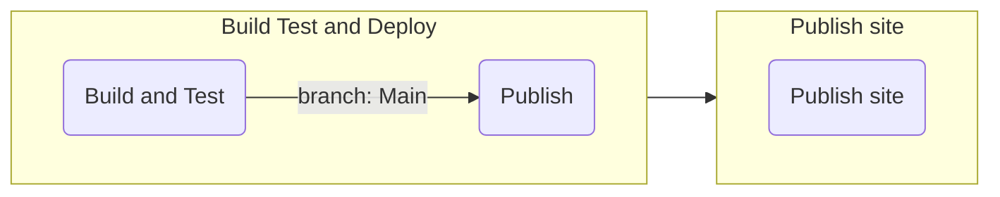
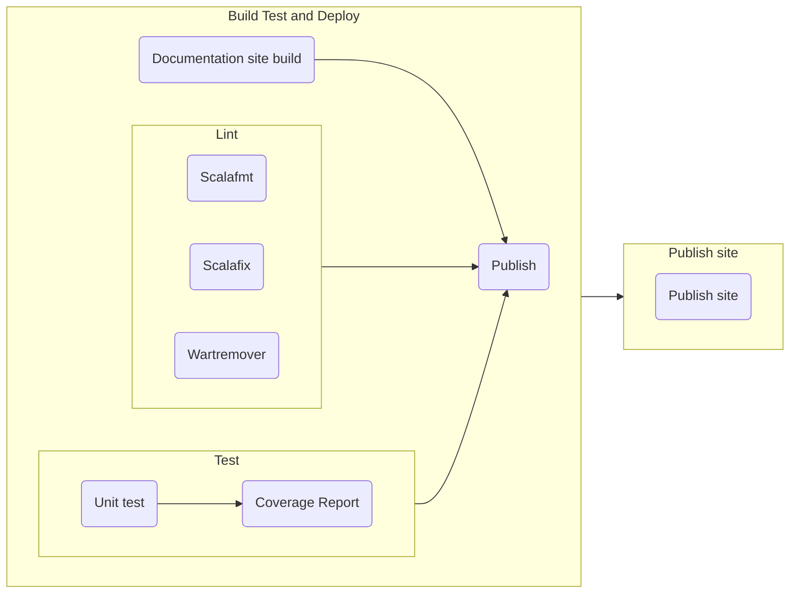

# Continuous Integration and Delivery

In this section we analyze the setup of the CI/CD, in particular the workflows used in the pipeline implementation.

The pipeline is structured in the following jobs:

- The `build` job which is responsible for building the project and running the tests. It is composed
  of different steps:

  - `quality assurance` in which `wartremover`, `scalafix` and `scalafmt` are executed
  - `test` in which all the tests are executed and the coverage report is generated
  - `build site` in which the documentation site is built

- The `deploy` job which is responsible for deploying the artifacts like jars and docker images.
  It only runs if the `build` job is successful and the workflow is running on the `main` branch and
  not in a pull request

The documentation site is published in another workflow, which is triggered when the previous one is
completed. This workflow is responsible for building the documentation site and publishing it to the
`gh-pages` branch.
This behavior can be achieved by defining a dependency between the two workflows, as shown in the following snippet:

```yaml
on:
  workflow_run:
    workflows: [Build test and deploy]
    types:
      - completed
```

In this way after the `Build test and deploy` workflow is completed, the `Publish site` workflow is triggered and the site is published using the last git tag as the project version.

The site publication is in a different workflow because we want to publish it by assigning the correct
project version, and we want to be able to update and publish it independently from the release of new versions of the developed software.

The following diagram shows the pipeline structure:



## Pipeline optimizations

In order to cut down on our GitHub Action minutes usage we parallelized different steps that could be
performed independently.
The resulting pipeline has 5 independent jobs: the three quality assurance commands we described earlier
(`scalafmt`, `scalafix`, `wartremover`) are no longer executed sequentially; the remaining two jobs
are responsible for the unit testing and site build.

With this new pipeline we managed to almost halve the CI times.

The following diagram shows the structure of the new pipeline:



## The `scala-release` action

We realized that the release process was almost always identical in many different projects we developed.
That is why we decided to refactor those steps into a configurable action.
It configures a Java/Scala environment, sets up `semantic-release` if enabled, and then runs the commands
to make a release that can also be customized via a property.
For further information about the `scala-release` action,
visit the [action page's repository](https://github.com/atedeg/scala-release).
